# Architecture Ref.Card 02 - React Application (serverless)

Link zur Übersicht<br/>
https://gitlab.com/bbwrl/m346-ref-card-overview

## Installation der benötigten Werkzeuge

Für das Bauen der App wird Node bzw. npm benötigt. Die Tools sind unter 
der folgenden URL zu finden. Für die meisten Benutzer:innen empfiehlt sich 
die LTS Version.<br/>
https://nodejs.org/en/download/

Node Version Manager<br/>
Für erfahren Benutzer:innen empfiehlt sich die Installation des 
Node Version Manager nvm. Dieses Tool erlaubt das Installiert und das 
Wechseln der Node Version über die Kommandozeile.<br/>
**Achtung: Node darf noch nicht auf dem Computer installiert sein.**<br/>
https://learn2torials.com/a/how-to-install-nvm


## Inbetriebnahme auf eigenem Computer

Projekt herunterladen<br/>
```git clone git@gitlab.com:bbwrl/m346-ref-card-02.git```
<br/>
```cd architecture-refcard-02```

### Projekt bauen und starten
Die Ausführung der Befehle erfolgt im Projektordner

Builden mit Node/npm<br/>
```$ npm install```

Das Projekt wird gebaut und die entsprechenden Dateien unter dem Ordner node_modules gespeichert.

Die App kann nun mit folgendem Befehl gestartet werden<br/>
```$ npm start```

Die App kann nun im Browser unter der URL http://localhost:3000 betrachtet werden.


### Inbetriebnahme mit Docker Container

### Inbetriebnahme mit Docker Container
Als erstes ein Dockerfile erstellen im Hauptordner

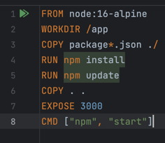

### Git-Hub Actions YAML-Datei erstellen
Das File muss in im Ordner .github/workflows sein welche neu erstellt werden müssen.

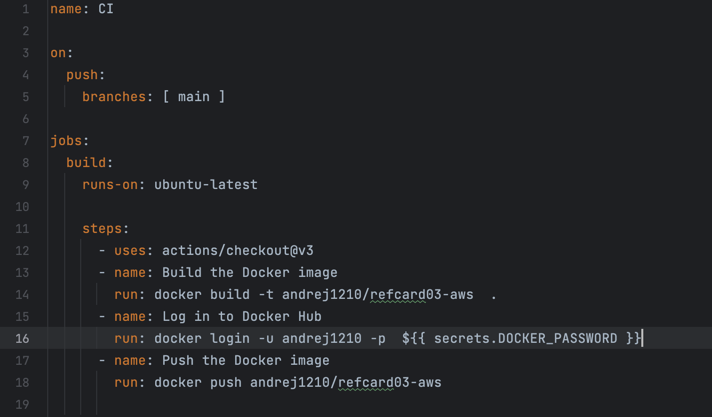
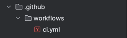

### Auf Dockerhub Access-Token erstellen

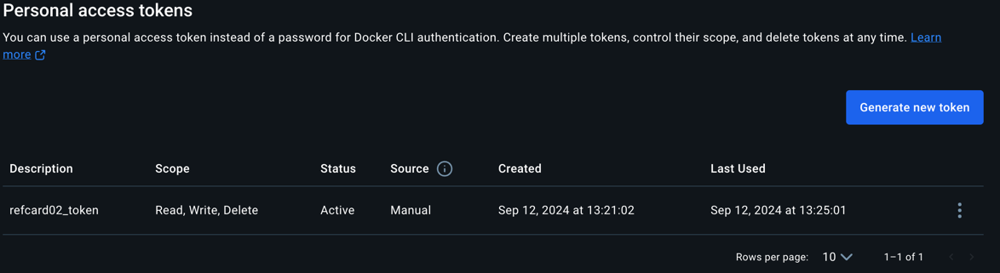

### Token auf Git tun
Der Token muss dann auf git hinterlassen werden unter Secrets und der Name muss dann auch im YML file sein

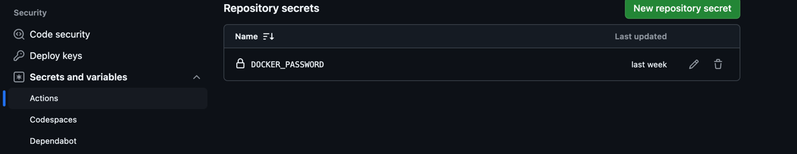

### File pushen auf Git
Dann ist es unter Actions ersichtlich

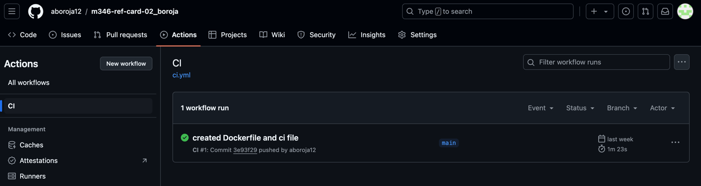

### Log in to Aws 

Als erstes auf AWS einlogge und "aws_access_key_id", "aws_secret_access_key" und "aws_session_token" kopieren und auf github als secret speichern. Aber die Region nicht vergessen

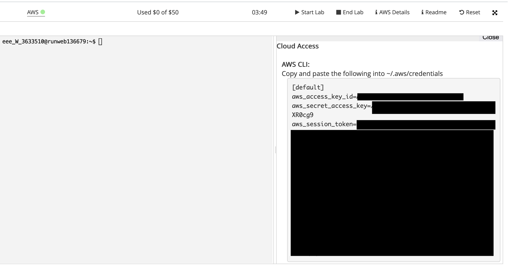

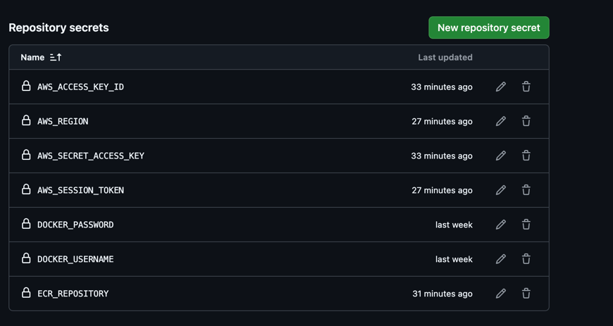

### ECR erstellen

Auf ECR gehen und danach die ECR erstellen, hier sind keine Konfigurationen nötig, nur der Name

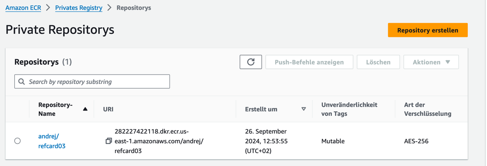

### ECS-Cluster erstellen

Ein Cluster erstellen, Namen geben und auf AWS Fargate lassen

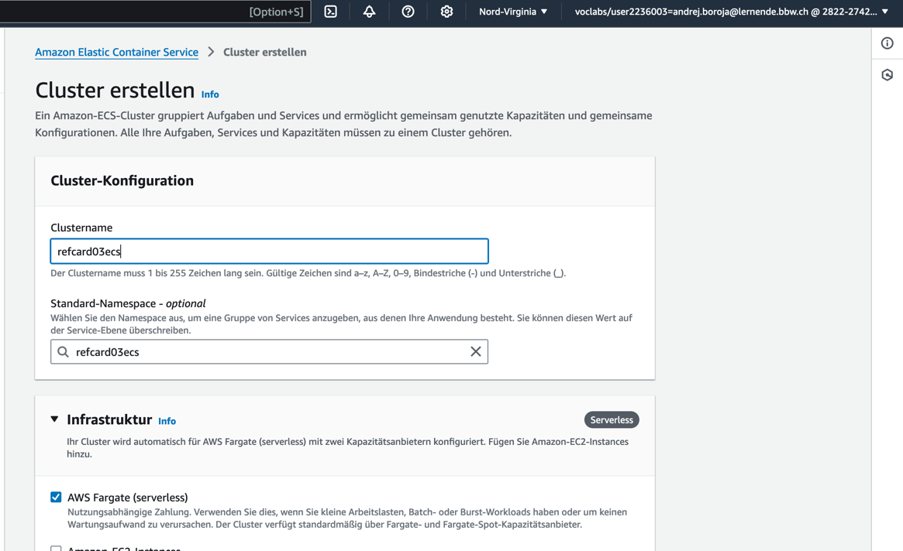

### Aufgabendefinition erstellen

Auf "neue Aufgabendefinition erstellen" drücken und Schritt für Schritt alles angeben

Zuerst Namen geben und AWS-Fargate auswählen

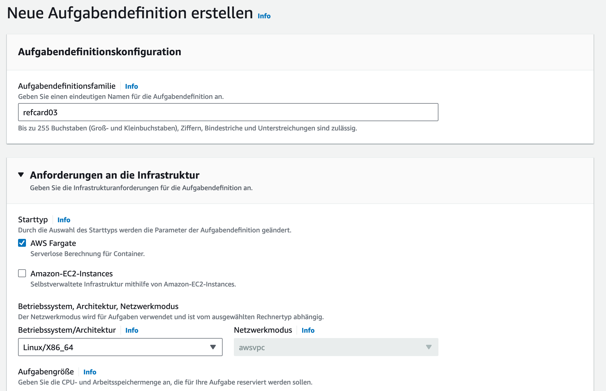

LabRole auswählen

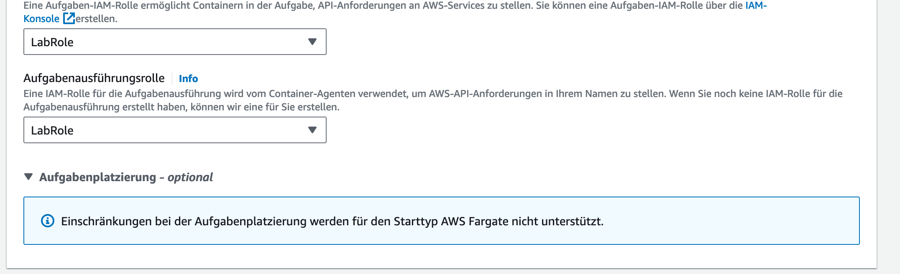

Bei der Aufgabendefinition noch die Image url von ECR angeben, entrypoint hineinschreiben und den Port angeben 

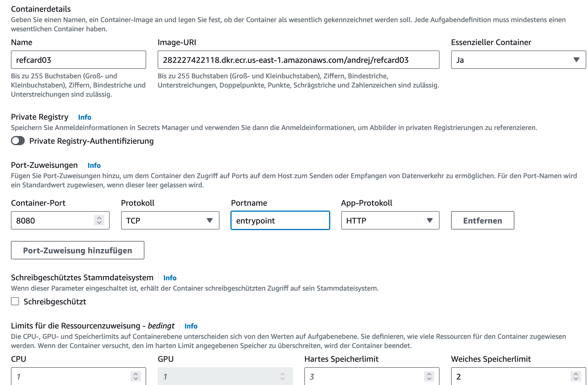

### ECS-Service erstellen

Bei Beretstellen auf Service erstellen klicken

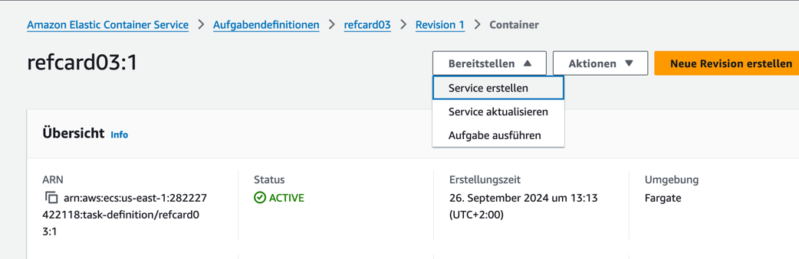

Cluster auswählen oben und danach
den Namen angeben. Dann Service erstellen.

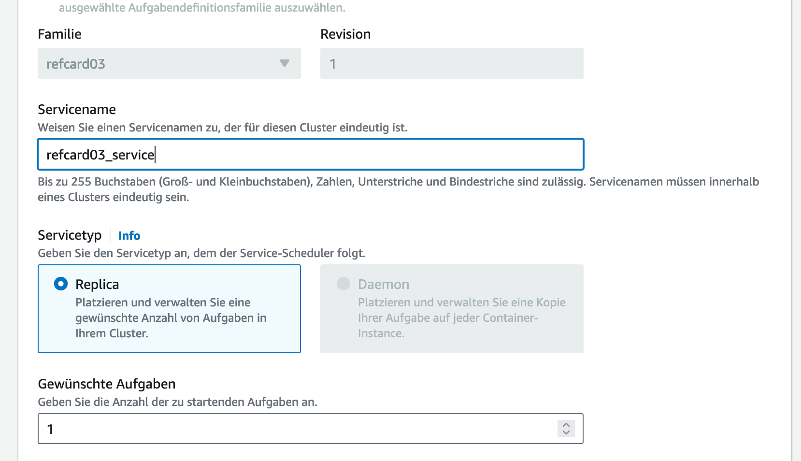

### Github Actions

Nach dem pushen siet man das auf GutHub Actions

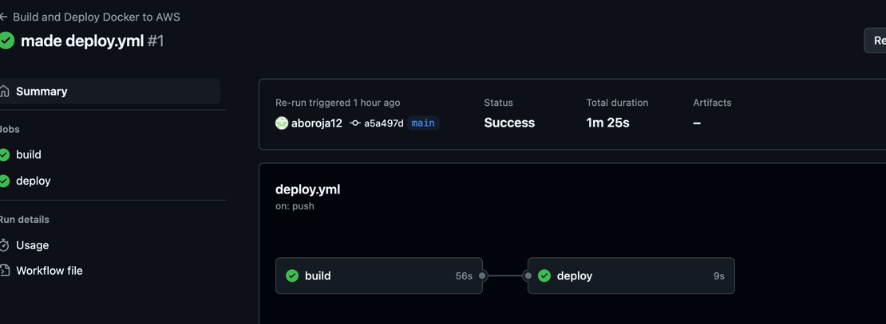

### Image auf ECR

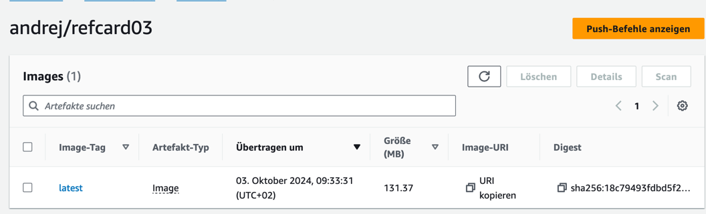

### Überprüfung

Um zu schauen ob alles geklappt hat kann man hier klicken und die Seite sehen

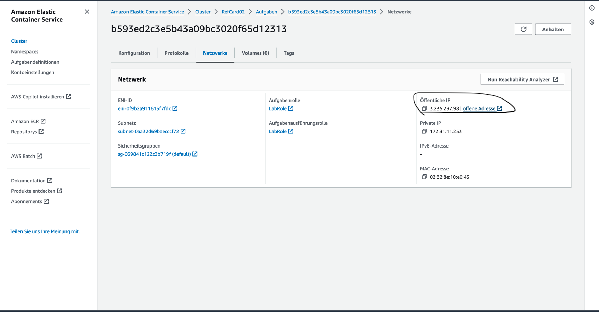


